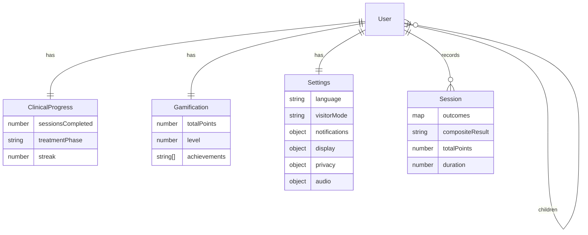
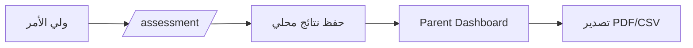
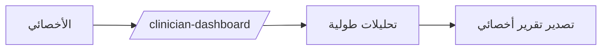
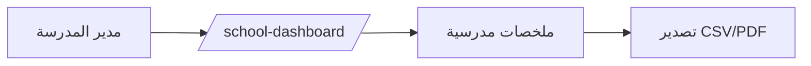

# مخططات المعمارية (Architecture Diagrams)

## System Architecture
```mermaid
flowchart LR
  U[Users] --> FE[Frontend: React + Vite]
  FE --> SW[Service Worker]
  FE --> API[API: Express /api]
  SW --> Q[Offline Queue (IndexedDB)]
  API --> DB[(MongoDB)]
```

## ERD (مبسّط)


## Workflows





