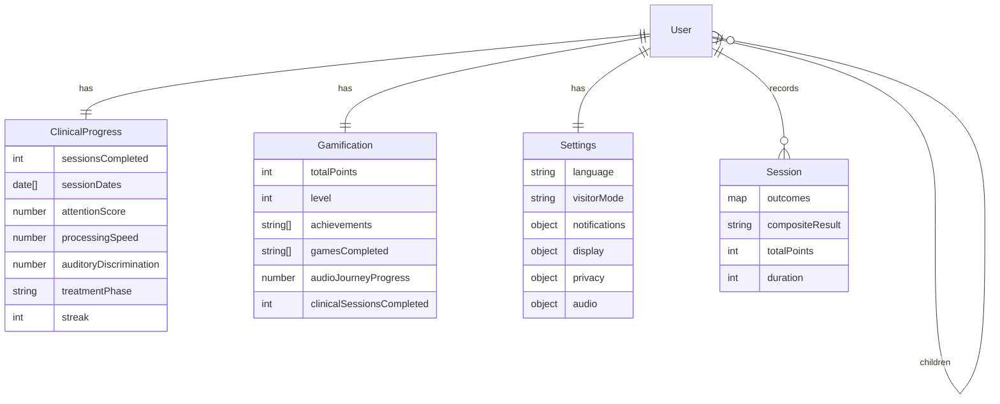

# ARCHITECTURE_DIAGRAMS — مخططات معمارية
الرسوم أدناه تعكس الشيفرة الحالية (واجهة Vite/React، خلفية Express/Mongo، تخزين محلي وأوفلاين).

## 1) System Architecture / بنية النظام
```mermaid
graph TD
  UA[متصفح المستخدم<br/>AR-first/EN toggle] -->|HTTPS| FE[واجهة React (Vite build)]
  FE -->|REST /api| BE[Express API<br/>backend/]
  FE -->|assetUrl + BASE_URL| CDN[أصول ثابتة /public]
  BE --> DB[(MongoDB)]
  BE -->|Uploads| FS[uploads/ static]
  FE -.->|Optional WS| WS[WebSocket endpoint]
  FE -.->|Service Worker (cache)| SW[public/sw.js<br/>cache-first للأصول]
```

## 2) ERD / نموذج الكيانات


## 3) Workflows / تدفقات المستخدمين
```mermaid
flowchart LR
  subgraph Parent / ولي الأمر
    P0[اختيار اللغة + وضع الزائر] --> P1[/assessment/ الألعاب]
    P1 --> P2[تخزين محلي SBLAB_SESSION_HISTORY]
    P2 --> P3[/parent-dashboard/]
    P3 --> P4[تصدير PDF/CSV]
  end
  subgraph Clinician / أخصائي
    C0[Login] --> C1[/clinician-dashboard/]
    C1 --> C2[عرض المرضى + اتجاهات]
    C2 --> C3[Sync API إذا متصل]
    C3 --> C4[تصدير تقرير]
  end
  subgraph School Admin / مسؤول مدرسة
    S0[Login] --> S1[/school-dashboard/]
    S1 --> S2[بيانات دفعة ديمو/محلية]
    S2 --> S3[تصدير CSV صف/كامل]
  end
```
