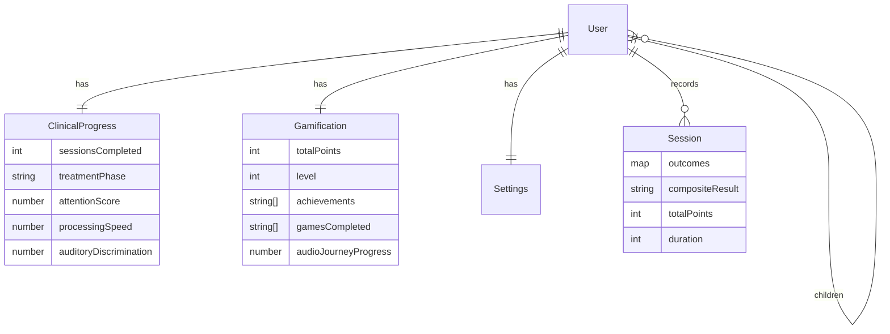

# IMPLEMENTATION_PLAN — خطة تنفيذ واقعية (Arabic-first)
إعادة بناء الخطة بناءً على ما هو موجود فعليًا في المستودع (واجهة Vite/React وخلفية Express/Mongo). تشمل التبديل إلى الإنجليزية واعتبارات الـ RTL/LTR.

## A) نطاق المنتج (Product Scope)
- منصة AIT (Berard) بلمسة طبية/مستقبلية: محتوى تسويقي عربي أول، مختبر تقييمات سمعية، لوحات تقدم، تلعيب، وأدوات تصدير PDF/CSV.
- الشرائح والفيديوهات والتحميلات مدمجة محليًا (assets/downloads/fonts) لتجربة بلا إنترنت جزئيًا.

## B) لمحة عن الحالة الحالية (Current State Snapshot)
- **Front-end** مكتمل صفحات المسار العام، ألعاب مختبر متعددة (attention/frequency/sequence/dichotic/speech-in-noise/focused_attention/questionnaire)، ولوحات دورية (ولي، أخصائي، مدرسة) تعتمد على بيانات ديمو/تخزين محلي.
- **Back-end** حاضر تحت `backend/` مع نماذج Mongoose وواجهات REST كاملة (auth, clinical, gamification, settings, sessions, sync, admin، uploads).
- **أوفلاين**: طابور طلبات `lotus_offline_queue`، تخزين جلسات مختبر `SBLAB_SESSION_HISTORY`، إعدادات ولغة/دور الزائر في localStorage. Service worker غير مسجل بعد.
- **i18n**: `LanguageContext` يفرض AR/EN والاتجاه ويتيح تبديلًا فوريًا، مع نصوص مهيأة في `src/i18n/translations.ts`.

## C) الهيكل المعماري (Architecture)
الواجهة ثابتة (Vite build) يمكن نشرها على GitHub Pages أو Nginx، تتحدث إلى خدمة خلفية Express مستقلة + MongoDB. WebSocket placeholder موجود لكن غير موصوف في الواجهة الحالية.

```mermaid
graph TD
  A[المتصفح (RTL/LTR)] -->|HTTPS/REST| B[واجهة React/Vite<br/>cdn/base path aware]
  B -->|JWT Bearer + refresh| C[خدمة API Express<br/>/api/*]
  C --> D[(MongoDB)]
  C -->|Uploads/Static| E[uploads/]
  B -->|Service Worker fetch<br/>cache-first للأصول| F[SW (غير مسجل افتراضيًا)]
  B -.->|WebSocket placeholder| G[(WS Endpoint)]
```

## D) الأدوار وضبط الصلاحيات (RBAC)
- الأدوار: guest, patient, parent, clinician, school_admin, super_admin.
- صلاحيات UI كما في `UserContext` (حفظ التقدم، تقارير الطفل/المريض، تحليلات المدرسة/العالمية، ضبط النظام).
- علاقة ولي الأمر ↔ الأطفال عبر `children[]`; الحقول التنظيمية `clinic`/`school`.
- الحماية الصارمة تتم في الخلفية عبر middleware `authenticate/authorize`، بينما الواجهة تعتمد على إخفاء/تعطيل المسارات.

## E) نماذج البيانات (Data Models)
- **User**: الهوية، الدور، العيادة/المدرسة، الأطفال، الرموز المتجددة.
- **ClinicalProgress**: جلسات منجزة، تواريخ، ملف سمعي، درجات attention/processing/auditory-discrimination، الأهداف الأسبوعية، المرحلة، السلسلة.
- **Gamification**: نقاط/مستوى، إنجازات، مناطق دماغ، شرائح/ألعاب/فيديوهات، تقدم رحلة صوتية، زمن تفاعل، تقدم سريري.
- **Settings**: لغة، وضع زائر، إشعارات، عرض (تقليل الحركة/التباين/حجم الخط)، خصوصية، صوت.
- **Session**: نتائج Map لكل اختبار (high/medium/low + metrics)، نقاط كلية، إنجازات، مدة.
- **Notes/Signature**: غير موجودة في الواجهة الآن؛ تُذكر كامتداد مستقبلي في خطة الدمج مع clinical progress/export.
- **Gamification Narrative/Goals**: مخزنة بالواجهة ومحفوظة في `lotus_gamification_state`.
- **Sync payload**: يجمع clinicalProgress + gamification + settings + sessions.

## F) وحدات التقييم (Assessment Modules)
- الانتباه (Go/No-Go), الانتباه المركز (CPT), تمييز التردد (2IFC), التسلسل (ذاكرة عاملة), الاستماع الثنائي (integration/separation), الكلام وسط الضجيج (SNR), الاستبيان (أهالي), حزمة `suite` التجميعية.
- المخرجات: score100/band، مؤشرات تعب/تباين، دقة/زمن استجابة، span، توازن أذن، عتبة SNR، نقاط تلعيب.
- التخزين: ‎`SBLAB_SESSION_HISTORY`‎ مع بيانات ديمو عند غياب الجلسات المحلية.

## G) التحليلات الطولية (Longitudinal Analytics)
- خطوط الاتجاه والسلالم (مستويات) في `LongitudinalCharts` تعتمد على sessionStorage أو بيانات ديمو.
- حسابات مثل fatigue index، max span، trend (improving/stable/declining) في ألعاب التسلسل/الانتباه.
- يجب الحفاظ على دعم RTL في الرسوم (label alignment) والتأكد من تبديل اللغة في المحاور.

## H) الأوفلاين والمزامنة (Offline-first + Sync)
- **طابور أوفلاين**: ‎`lotus_offline_queue`‎ يحتفظ بطلبات غير GET ويعاد تشغيله عند الاتصال.
- **مفاتيح مزامنة**: ‎`lotus_last_sync`‎, ‎`lotus_pending_changes`‎, ‎`lotus_clinical_progress`‎, ‎`lotus_gamification_state`‎, ‎`lotus_user_settings`‎, ‎`lotus_language`‎, ‎`lotus_visitor_mode`‎, ‎`berard-ait-sessions`‎.
- **Service Worker**: cache-first للأصول، network-first محدود للوحة المتصدرين؛ يتطلب تسجيل يدوي.
- **Sync API**: `/api/sync` (مصادقة) و`/api/sync/beacon` (إرسال مع رمز في الحمولة) تدمج بيانات الخادم والمحلي مع فض النزاعات.

## I) التصدير (PDF/CSV)
- jsPDF lazy في `utils/pdf.ts`; تقارير الألعاب (`components/games/report.ts`)، تقارير الأدوار (`dashboards/roleDashboardExports.ts`)، تصدير التقدم السريري (`ProgressExport`)، وحزم المدارس (`SchoolPartnershipSection`).
- CSV سريع للجلسات/الصف، PDF للشرائح وعينات المختبر وحقائب المدارس.
- حزمة التحميلات الجاهزة في `public/downloads` (قائمة تحقق وبروفايل).

## J) الوصول واللغات (Accessibility + i18n)
- RTL افتراضي، تبديل فوري إلى EN، تحديث dir/lang/الخط في document.
- دعم تقليل الحركة (`lotus_user_settings` + data attribute)، حدود تركيز واضحة، مفاتيح تنقل.
- الخط Cairo محمّل مسبقًا؛ حجم الخط قابل للضبط من الإعدادات.

## K) الأمن (Security Considerations)
- JWT Bearer في التخزين المحلي، تجديد عبر `/auth/refresh`.
- CORS مضبوط في الخادم، rate limiting، CSRF double-submit.
- حماية RBAC على السيرفر؛ الواجهة تحتاج حراسة routes الحساسة إذا لزم.
- حماية بيانات PII: حذف الحساب يمسح ClinicalProgress/Gamification/Settings/User.

## L) استراتيجية الاختبار (Testing Strategy)
- وحدات/تكامل: Vitest + Testing Library (بيئة jsdom).
- E2E: Playwright (يوجد config).
- اختبارات أوفلاين/طابور: إضافة وحدات لـ `api.ts` و`SyncContext`.
- RBAC: اختبارات لتحقق من حجب مكونات الداشبورد حسب الدور.
- ضمان أصول: `npm run qa:assets`.

## M) مصفوفة الأولويات (P0/P1/P2/P3)
- **P0**: إصلاح typecheck (توحيد Vite/Vitest أو تخفيف التكوين)، تسجيل Service Worker اختياري خلف علم، توثيق قاعدة النشر BASE_PATH/BASE_URL، حماية رموز JWT.
- **P1**: ربط لوحات الديمو ببيانات API حقيقية (sessions/clinical/gamification)، توحيد مفاتيح التخزين وتطهير عند تسجيل الخروج.
- **P2**: اختبارات أوفلاين/Sync، تحسين تجربة الأجهزة المحمولة RTL، توسيع تصدير CSV (صف/مريض) مع RBAC صارم.
- **P3**: WebSocket للتنبيهات/اللوحة المباشرة، إمضاء رقمي/ملاحظات سريرية، دمج uploads في الواجهة.

## N) خارطة طريق دمج الخلفية (Backend Integration)
- **Auth**: استخدام `authApi` (login/register/refresh/profile/logout/delete). الحفاظ على تخزين ‎`lotus_auth_token`‎/refresh. إعادة محاولة تلقائية على 401 موجودة في `fetchWithAuth`.
- **Clinical**: `/clinical/progress` GET/PATCH، `/clinical/session/complete` لزيادة الجلسات، `/clinical/history`، `/clinical/patient/:id` (clinician/super_admin).
- **Gamification**: `/gamification/state` GET/PATCH، `/gamification/achievements/:id/unlock`, `/gamification/leaderboard?type=global|clinic|school`.
- **Settings**: `/settings` GET/PATCH.
- **Sessions**: `/sessions` CRUD + `/analysis/progress?testKey=...` لبيانات اتجاهية.
- **Sync**: `/sync` و`/sync/beacon` لدمج بيانات الأوفلاين؛ تضمين ‎`lastSyncAt`‎ وتطبيع المخزن المحلي.
- **Uploads/Admin**: موجودة في الخلفية، تحتاج شاشات UI مستقبلية.

## O) الملحق (Routes + Module IDs + Storage Schema)
- **Routes**: انظر جدول قسم المسارات أعلاه.
- **Module IDs**: `attention`, `focused_attention`, `frequency`, `sequence`, `dichotic_listening`, `speech_in_noise`, `questionnaire`, `suite`.
- **Local/Session Storage**: انظر قسم التخزين المحلي؛ يجب تنظيف ‎`lotus_*`‎ و‎`SBLAB_SESSION_HISTORY`‎ عند تسجيل الخروج الكامل/حذف الحساب.

## مخططات مرسومة (Mermaid)
تفاصيل موسعة في `docs/ARCHITECTURE_DIAGRAMS.md`، ويعاد إدراجها هنا للرجوع السريع.

```mermaid
flowchart TD
  subgraph Parent Journey
    A0[تسجيل دخول/ديمو] --> A1[/parent-dashboard/]
    A1 --> A2[اختيار طفل]
    A2 --> A3[عرض الرسوم الطولية]
    A3 --> A4[تصدير PDF/CSV]
  end
  subgraph Clinician Journey
    C0[تسجيل دخول] --> C1[/clinician-dashboard/]
    C1 --> C2[اختيار مريض]
    C2 --> C3[Trend + Notes]
    C3 --> C4[تحليل جلسة/تصدير]
  end
  subgraph School Admin Journey
    S0[تسجيل دخول] --> S1[/school-dashboard/]
    S1 --> S2[مراقبة الدُفعات]
    S2 --> S3[تصدير CSV صف/كامل]
  end
```




