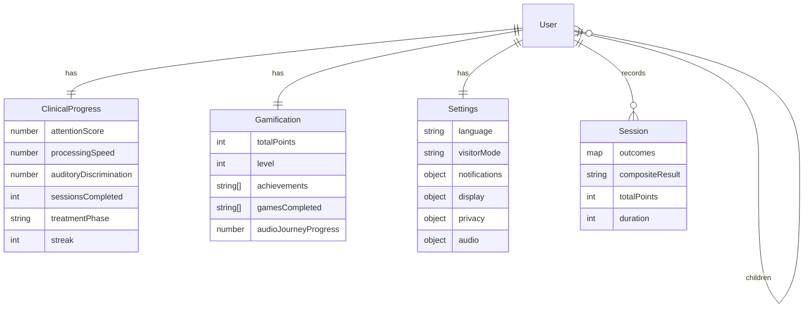

# IMPLEMENTATION_PLAN — Arabic-first, repo-grounded

## A) Product scope
- منصة Berard AIT عربية أولًا (EN toggle) تقدم صفحات عامة، مختبر تقييمات سمعية (7 وحدات)، لوحات تقدم حسب الدور، تلعيب، وتصدير PDF/CSV، مع دعم أوفلاين وطابور مزامنة عبر العميل.【F:src/App.tsx†L515-L724】【F:src/services/api.ts†L36-L119】
- مسار النشر المستهدف: واجهة React/Vite ثابتة، تتحدث مع خدمة API (VITE_API_URL) لمزامنة التقدم السريري/التلعيب والجلسات.【F:src/services/api.ts†L36-L119】

## B) Current State Snapshot
- **Routes**: صفحات عامة (Landing, Assessment, Program, Science, Results, Partners, Resources, FAQ, Contact, About, BrainFunction)، Auth (/login)، لوحات `/parent-dashboard`, `/clinician-dashboard`, `/school-dashboard`, `/settings`, ومسارات تراثية للدور.【F:src/App.tsx†L515-L724】
- **Backend presence**: مجلد `backend/` يحتوي Express + MongoDB (صحة، auth، clinical، gamification، settings، sessions، sync، uploads، admin).【F:backend/src/index.js†L6-L120】
- **i18n/RTL**: `LanguageProvider` يضبط `dir/lang` ويخزن اللغة محليًا ويعرض اختيار لغة عند أول زيارة.【F:src/context/LanguageContext.tsx†L62-L105】
- **Offline**: طابور `lotus_offline_queue`، رموز auth، وعمليات إعادة تشغيل للمزامنة في `api.ts`.【F:src/services/api.ts†L36-L119】
- **Modules**: suite + 7 وحدات (attention, focused_attention, frequency, sequence, dichotic_listening, speech_in_noise, questionnaire) مع نصوص عربية/إنجليزية ومقاييس مخرجة.【F:src/components/GameSection.tsx†L752-L832】

## C) Architecture (frontend + separate backend + DB)
- Frontend: React 18 + Vite (static build) يستخدم `BASE_URL`، يستدعي REST عبر `VITE_API_URL`.  
- Backend: Express API (في repo الآن) قابل للنشر كخدمة مستقلة، يقدم /api/* ويصل MongoDB.【F:backend/src/index.js†L6-L120】  
- DB: Mongo (نماذج عبر Mongoose في backend).  
- التواصل: fetch مع JWT bearer وتحديث تلقائي/طابور أوفلاين من `api.ts`.【F:src/services/api.ts†L36-L119】

## D) Roles & RBAC
- الأدوار: guest, patient, parent, clinician, school_admin, super_admin؛ الأذونات (view/play/save/reports/analytics/config) معرفّة في `UserContext`.【F:src/context/UserContext.tsx†L18-L103】
- حماية الواجهة عبر حجب UI (لا حراسة routes بعد)، بينما الخادم يفرض `authenticate/authorize` للأدوار السريرية/الإدارية.【F:backend/src/index.js†L112-L120】

## E) Data Models (frontend view + backend intent)
- User + relations (clinic/school/children).【F:src/context/UserContext.tsx†L20-L35】
- ClinicalProgress: درجات attention/processing/auditoryDiscrimination، جلسات، phase، streak.【F:src/context/UserContext.tsx†L27-L48】
- Gamification: نقاط/مستوى/إنجازات ومؤشرات تفاعل (context + API).【F:src/context/GamificationContext.tsx†L408-L535】
- Settings: لغة، وضع زائر، عرض/خصوصية/صوت.【F:src/components/SettingsPage.tsx†L51-L146】
- Session: outcomes map + compositeResult/points/duration (backend sessions).【F:backend/src/routes/sessions.js†L16-L126】

## F) Assessment Modules (implemented)
| moduleId | Label (AR/EN) | Metrics مختصرة | Export | مصدر |
| --- | --- | --- | --- | --- |
| suite | مجمع / Suite | RT, Accuracy, Threshold, Span | PDF/CSV | 【F:src/components/GameSection.tsx†L752-L762】 |
| attention | الانتباه / Attention | RT, Accuracy | PDF/CSV | 【F:src/components/GameSection.tsx†L764-L772】 |
| focused_attention | الانتباه المركز / Focused Attention | RT, Accuracy | PDF/CSV | 【F:src/components/GameSection.tsx†L773-L782】 |
| frequency | التردد / Frequency | Threshold, Accuracy, RT | PDF/CSV | 【F:src/components/GameSection.tsx†L783-L791】 |
| sequence | التسلسل / Sequence | Span, Accuracy, RT | PDF/CSV | 【F:src/components/GameSection.tsx†L793-L801】 |
| dichotic_listening | الاستماع الثنائي / Dichotic | Accuracy, Profile | PDF/CSV | 【F:src/components/GameSection.tsx†L803-L811】 |
| speech_in_noise | الكلام وسط الضجيج / Speech in Noise | Threshold, Accuracy | PDF/CSV | 【F:src/components/GameSection.tsx†L813-L821】 |
| questionnaire | الاستبيان / Questionnaire | Score, Profile | PDF/CSV | 【F:src/components/GameSection.tsx†L823-L832】 |

## G) Longitudinal analytics
- لوحات `/parent-dashboard`, `/clinician-dashboard`, `/school-dashboard` تستخدم مقاييس مسارات الجلسات (local/demo) لعرض اتجاهات طويلة المدى.【F:src/App.tsx†L654-L710】

## H) Offline-first & Sync
- تخزين محلي للمصادقة (`lotus_auth_token`/`lotus_refresh_token`)، طابور `lotus_offline_queue`، وإعادة التشغيل عبر `processOfflineQueue`.【F:src/services/api.ts†L36-L119】
- تاريخ جلسات المختبر `SBLAB_SESSION_HISTORY`، جلسات العلاج `berard-ait-sessions`, مفاتيح sync (`lotus_last_sync`, `lotus_pending_changes`).【F:src/utils/sessionStorage.ts†L5-L124】【F:src/context/SyncContext.tsx†L49-L225】

## I) Exports (PDF/CSV)
- تقارير الجلسة PDF/CSV في `components/games/report.ts`.【F:src/components/games/report.ts†L1-L115】
- أزرار تصدير لوحات (Parent/Clinician CSV/PDF) في `roleDashboardExports`.【F:src/components/dashboards/roleDashboardExports.ts†L1-L234】
- عارض الشرائح يصدر PDF من الشرائح المحلية (pptx_slides).【F:src/components/SlideViewer.tsx†L794-L905】

## J) Accessibility & i18n
- RTL/LTR switching مع تحديث `dir/lang`، وخط Cairo وتخزين اللغة محليًا.【F:src/context/LanguageContext.tsx†L62-L96】
- إعدادات تقليل الحركة عبر `lotus_user_settings` تطبق قبل الرسم الأول.【F:src/main.tsx†L1-L16】

## K) Testing strategy
- Scripts: typecheck, build, lint, vitest, playwright, qa:assets.【F:package.json†L6-L19】
- الحد الأدنى: تشغيل `npm run typecheck`, `npm run build`, `npm run qa:assets` قبل الإصدار.

## L) Priority matrix (P0→P3)
- **P0**: تعزيز حماية RBAC في الواجهة (حراس routes) وربط بيانات حقيقية للوح الديمو.  
- **P1**: تمكين تسجيل Service Worker اختياريًا للأوفلاين وتغطية طابور المزامنة بالاختبارات.  
- **P2**: تحسين تجارب الموبايل RTL، وتحسين صادرات CSV للصف/المريض.  
- **P3**: دعم WebSocket للتنبيهات ورفع مستوى النشر المؤتمت.

## M) Roadmap for backend integration
- العميل يستخدم `VITE_API_URL` (افتراضي localhost:3001/api).【F:src/services/api.ts†L36-L119】
- نقاط الربط: auth/clinical/gamification/settings/sessions/sync كما في backend Express الحالي.【F:backend/src/index.js†L23-L120】
- احرص على إرسال JWT في Authorization ومزامنة البيانات عند العودة للاتصال.

## N) Appendix (Mermaid)


```mermaid
flowchart LR
  P0[Visitor selects AR/EN] --> P1[Browse public pages]
  P1 --> P2[/assessment/ run modules]
  P2 --> P3[Sessions saved locally/SBLAB_SESSION_HISTORY]
  P3 --> P4[Dashboards render trends]
  P4 --> P5[Export PDF/CSV]
  P3 -.-> P6[Sync API when online]
```
