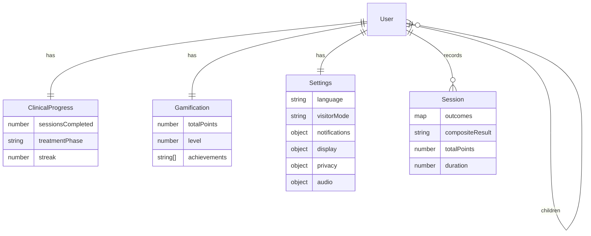
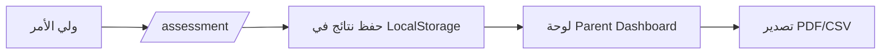
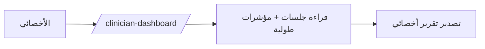
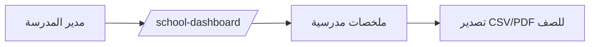

# خطة التنفيذ (Implementation Plan) — عربية أولاً، مبنية على واقع المستودع

## A) نطاق المنتج (Product Scope)
- منصة Berard AIT ثنائية اللغة (عربية أولاً + تبديل English) تجمع: محتوى تعريفي، مختبر تقييم سمعي، لوحات تقدّم بحسب الدور، تلعيب، وتصدير PDF/CSV. `src/App.tsx:31`, `src/components/games/AssessmentSuiteModal.tsx:40`, `src/components/games/report.ts:81`
- الواجهة والواجهة الخلفية موجودتان داخل المستودع لكن تُنشران كخدمتين منفصلتين. `backend/src/index.js:39`, `src/services/api.ts:39`

## B) لقطة الحالة الحالية (Current State Snapshot)
- الراوتر يعرّف المسارات العامة + لوحات الدور + إعدادات محمية. `src/App.tsx:521`
- RBAC مُعرّف في الواجهة مع RoleGuard/RequireAuth ضمن المسارات. `src/context/UserContext.tsx:88`, `src/App.tsx:659`
- نظام i18n/RTL مفعّل عبر `LanguageProvider` مع ضبط `dir/lang` وخط Cairo. `src/context/LanguageContext.tsx:62`
- تخزين أوفلاين + مزامنة موجودة (LocalStorage + IndexedDB + SyncContext). `src/context/SyncContext.tsx:52`, `src/utils/offlineQueue.ts:13`
- مجموعة تقييم كاملة 7 وحدات (بالإضافة لواجهة suite). `src/components/games/types.ts:4`, `src/components/games/AssessmentSuiteModal.tsx:40`
- لوحات الدور (Parent/Clinician/School) موجودة ومساراتها محمية. `src/App.tsx:659`
- واجهة التلعيب مفعّلة دائمًا. `src/App.tsx:746`

## C) المعمارية (Architecture)
- **Frontend**: React 18 + Vite، يعتمد `BASE_URL` لنشر فرعي. `src/App.tsx:23`
- **API Client**: يعتمد `VITE_API_URL` (افتراضي `http://localhost:3001/api`). `src/services/api.ts:39`
- **Backend**: Express + Mongo داخل `backend/` مع Swagger وWS. `backend/src/index.js:6`
- **Service Worker**: caching + background sync لطابور الأوفلاين. `public/sw.js:1`, `src/main.tsx:31`

## D) الأدوار + RBAC (Roles/RBAC)
- الأدوار المعتمدة: `guest`, `patient`, `parent`, `clinician`, `school_admin`, `super_admin`. `src/context/UserContext.tsx:9`, `backend/src/models/User.js:31`
- الصلاحيات موزعة عبر `ROLE_PERMISSIONS`. `src/context/UserContext.tsx:88`
- **مهم**: الكيان “Child” ليس نموذجاً منفصلاً؛ هو `User` بدور `patient` مع علاقة `children[]` في المستخدم الأب. `backend/src/models/User.js:44`

## E) نماذج البيانات (Data Models)
- **User**: بيانات الحساب/الدور/العلاقات. `backend/src/models/User.js:8`
- **ClinicalProgress**: مؤشرات سريرية + مرحلة علاج + streak. `backend/src/models/ClinicalProgress.js:16`
- **Gamification**: إنجازات + نقاط + نشاط. `backend/src/models/Gamification.js:25`
- **Settings**: لغة/وضع زائر/إشعارات/عرض/خصوصية/صوت. `backend/src/models/Settings.js:7`
- **Session**: نتائج التقييم + نقاط + مدة. `backend/src/models/Session.js:22`
- **Notes/Signature**: غير موجودة كنماذج حالياً (Gap).

## F) وحدات التقييم (Assessment Modules)
- الوحدات السبع: attention, focused_attention, frequency, sequence, dichotic_listening, speech_in_noise, questionnaire. `src/components/games/types.ts:4`
- كل وحدة تُنتج metrics محددة (RT, accuracy, threshold, fatigue, إلخ). `src/components/games/types.ts:18`
- مسار الـ suite يُرتّب الوحدات ضمن Modal. `src/components/games/AssessmentSuiteModal.tsx:40`

## G) التحليلات الطولية (Longitudinal Analytics)
- حساب الميل (slope) + نافذة rolling + ثقة القياس. `src/components/dashboards/LongitudinalCharts.tsx:50`
- استخدام جودة الجلسات (quality flags) ضمن التتبّع. `src/types/moduleMetrics.ts:3`

## H) Offline-first + Sync
- طابور Offline requests يُدار بـ IndexedDB. `src/utils/offlineQueue.ts:13`
- `SyncContext` يرسل/يستقبل بيانات محلية (clinical/gamification/settings/sessions). `src/context/SyncContext.tsx:146`
- `serviceWorker` يطلق sync ويستدعي `processOfflineQueue`. `public/sw.js:56`, `src/main.tsx:38`
- مفاتيح التخزين الأساسية (مع scoping `:userId`): `lotus_user_state`, `lotus_clinical_progress`, `lotus_gamification_state`, `lotus_user_settings`, `berard-ait-sessions`, `SBLAB_SESSION_HISTORY`, `lotus_offline_queue_db`, `lotus_last_sync`, `lotus_pending_changes`. `src/utils/userStorage.ts:24`

## I) التصدير (Exports)
- PDF/CSV لتقارير التقييم عبر `downloadSessionPdf/CSV`. `src/components/games/report.ts:81`
- تقارير لوحات (Parent/Clinician) PDF/CSV. `src/components/dashboards/roleDashboardExports.ts:20`
- تصدير تقدم عام + شرائح PDF. `src/components/ProgressExport.tsx:1`, `src/components/SlideViewer.tsx:794`

## J) الوصولية + i18n
- RTL/LTR وتبديل اللغة عبر `LanguageProvider`، مع أدوات محاذاة واتجاه. `src/context/LanguageContext.tsx:67`
- احترام reduced motion من الإعدادات قبل أول render. `src/main.tsx:9`

## K) اعتبارات الأمان (Security)
- تخزين token في LocalStorage (يتطلب حماية XSS). `src/services/api.ts:39`
- الواجهة الخلفية تفعّل CORS + rate limit + CSRF + sanitization. `backend/src/index.js:46`
- نقاط حرجة: التحقق الصارم من صلاحيات الوصول عبر الـ backend لمسارات المرضى/المدارس.

## L) استراتيجية الاختبار (Testing Strategy)
- وحدات: `Header.test.tsx`, `useOptimizedApi.test.ts`, `performance.test.ts`. `src/components/Header.test.tsx:1`
- E2E: `e2e/assessment.spec.ts`, `e2e/auth.spec.ts`, `e2e/navigation.spec.ts`, `e2e/route-guards.spec.ts`. `e2e`
- أوامر: `npm run typecheck`, `npm run build`, `npm run qa:assets`. `package.json:6`

## M) مصفوفة الأولويات (Priority Matrix)
- **P0**: توحيد RBAC بين الواجهة والباك (تحقق server-side لمسارات المرضى/المدارس + قيود المدرسة/العيادة). `backend/src/routes/clinical.js:166`
- **P1**: توسيع مزامنة البيانات (حل تعارضات أكثر + توثيق واضح في API_SPEC). `backend/src/routes/sync.js:32`
- **P2**: تحسين التصدير (Q/A للـ PDF/CSV متعدد اللغات + دقة RTL). `src/components/games/report.ts:141`
- **P3**: تعزيز الـ analytics بالبيانات الحقيقية من الـ API بدل الاعتماد الكامل على localStorage.

## N) خارطة التكامل مع الـ Backend (API Contract)
- الـ client يستدعي مجموعات endpoints: auth/clinical/gamification/settings/sessions/sync/health. `src/services/api.ts:305`
- تفصيل الحقول مذكور في `src/types/api.ts`. `src/types/api.ts:9`
- توثيق شامل في `docs/API_SPEC.md`.

## O) Gap Analysis (ما الذي ينقص فعليًا)

| Area | Repo reality | Gap | Evidence | Next step |
| --- | --- | --- | --- | --- |
| Notes/Signature models | غير موجودة كنماذج في الـ backend | نماذج Notes/Signature مطلوبة لكن غير منفّذة | `backend/src/models/index.js:5` | إضافة نماذج + endpoints إذا كانت مطلوبة وظيفيًا |
| Dashboards data source | تعتمد على `getSessionsOrDemo` من LocalStorage | لا يوجد ربط فعلي بجلب البيانات من `/sessions` | `src/pages/ParentDashboard.tsx:7`, `src/components/games/scoring.ts:653` | ربط dashboards بـ `sessionsApi` مع fallback محلي |
| Sessions analysis API | Endpoint موجود في backend | غير مدمج في الـ client | `backend/src/routes/sessions.js:152` | إضافة مسار `sessionsApi.getProgressAnalysis()` عند الحاجة |

## Appendix A) جداول المسارات/الموديولات/التخزين
- راجع `docs/APP_TABLES.md` للجدول الكامل (Routes + Storage + Module IDs).

## Appendix B) الرسوم البيانية (Mermaid)

### B1) System Architecture
```mermaid
flowchart LR
  U[Users] --> FE[Frontend: React + Vite]
  FE --> SW[Service Worker]
  FE --> API[API: Express /api]
  SW --> Q[Offline Queue (IndexedDB)]
  API --> DB[(MongoDB)]
```

### B2) ERD


### B3) Workflows





