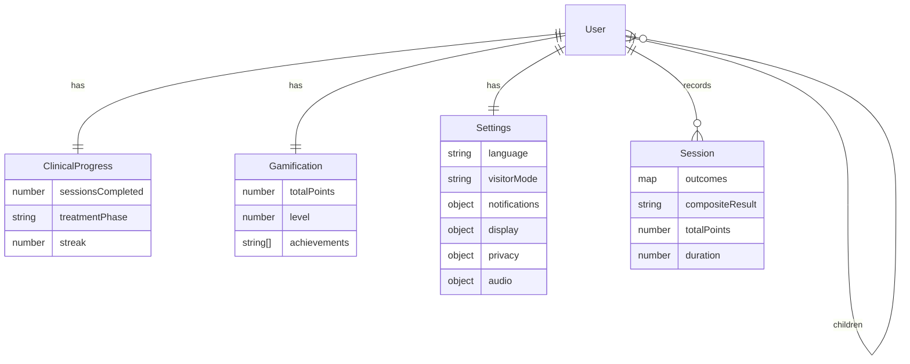
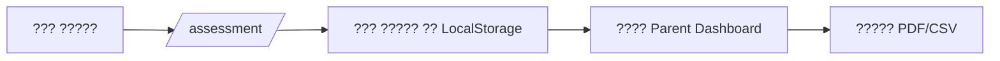
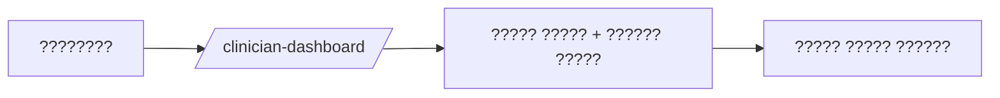

# ??? ??????? (Implementation Plan) — ????? ?????? ????? ??? ???? ????????

## A) ???? ?????? (Product Scope)
- ???? Berard AIT ?????? ????? (????? ????? + ????? English) ????: ????? ??????? ????? ????? ????? ????? ????? ???? ?????? ?????? ?????? PDF/CSV. `src/App.tsx:31`, `src/components/games/AssessmentSuiteModal.tsx:40`, `src/components/games/report.ts:81`
- ??????? ???????? ??????? ???????? ???? ???????? ??? ??????? ??????? ????????. `backend/src/index.js:39`, `src/services/api.ts:39`

## B) ???? ?????? ??????? (Current State Snapshot)
- ??????? ????? ???????? ?????? + ????? ????? + ??????? ?????. `src/App.tsx:521`
- RBAC ?????? ?? ??????? ?? RoleGuard/RequireAuth ??? ????????. `src/context/UserContext.tsx:88`, `src/App.tsx:659`
- ???? i18n/RTL ????? ??? `LanguageProvider` ?? ??? `dir/lang` ??? Cairo. `src/context/LanguageContext.tsx:62`
- ????? ??????? + ?????? ?????? (LocalStorage + IndexedDB + SyncContext). `src/context/SyncContext.tsx:52`, `src/utils/offlineQueue.ts:13`
- ?????? ????? ????? 7 ????? (???????? ?????? suite). `src/components/games/types.ts:4`, `src/components/games/AssessmentSuiteModal.tsx:40`
- ????? ????? (Parent/Clinician/School) ?????? ????????? ?????. `src/App.tsx:659`
- ????? ??????? ?????? ??????. `src/App.tsx:746`

## C) ????????? (Architecture)
- **Frontend**: React 18 + Vite? ????? `BASE_URL` ???? ????. `src/App.tsx:23`
- **API Client**: ????? `VITE_API_URL` (??????? `http://localhost:3001/api`). `src/services/api.ts:39`
- **Backend**: Express + Mongo ???? `backend/` ?? Swagger ?WS. `backend/src/index.js:6`
- **Service Worker**: caching + background sync ?????? ?????????. `public/sw.js:1`, `src/main.tsx:31`

## D) ??????? + RBAC (Roles/RBAC)
- ??????? ????????: `guest`, `patient`, `parent`, `clinician`, `school_admin`, `super_admin`. `src/context/UserContext.tsx:9`, `backend/src/models/User.js:31`
- ????????? ????? ??? `ROLE_PERMISSIONS`. `src/context/UserContext.tsx:88`
- **???**: ?????? “Child” ??? ??????? ???????? ?? `User` ???? `patient` ?? ????? `children[]` ?? ???????? ????. `backend/src/models/User.js:44`

## E) ????? ???????? (Data Models)
- **User**: ?????? ??????/?????/????????. `backend/src/models/User.js:8`
- **ClinicalProgress**: ?????? ?????? + ????? ???? + streak. `backend/src/models/ClinicalProgress.js:16`
- **Gamification**: ??????? + ???? + ????. `backend/src/models/Gamification.js:25`
- **Settings**: ???/??? ????/???????/???/??????/???. `backend/src/models/Settings.js:7`
- **Session**: ????? ??????? + ???? + ???. `backend/src/models/Session.js:22`
- **Notes/Signature**: ??? ?????? ?????? ?????? (Gap).

## F) ????? ??????? (Assessment Modules)
- ??????? ?????: attention, focused_attention, frequency, sequence, dichotic_listening, speech_in_noise, questionnaire. `src/components/games/types.ts:4`
- ?? ???? ????? metrics ????? (RT, accuracy, threshold, fatigue, ???). `src/components/games/types.ts:18`
- ???? ??? suite ?????? ??????? ??? Modal. `src/components/games/AssessmentSuiteModal.tsx:40`

## G) ????????? ??????? (Longitudinal Analytics)
- ???? ????? (slope) + ????? rolling + ??? ??????. `src/components/dashboards/LongitudinalCharts.tsx:50`
- ??????? ???? ??????? (quality flags) ??? ???????. `src/types/moduleMetrics.ts:3`

## H) Offline-first + Sync
- ????? Offline requests ????? ?? IndexedDB. `src/utils/offlineQueue.ts:13`
- `SyncContext` ????/?????? ?????? ????? (clinical/gamification/settings/sessions). `src/context/SyncContext.tsx:146`
- `serviceWorker` ???? sync ??????? `processOfflineQueue`. `public/sw.js:56`, `src/main.tsx:38`
- ?????? ??????? ???????? (?? scoping `:userId`): `lotus_user_state`, `lotus_clinical_progress`, `lotus_gamification_state`, `lotus_user_settings`, `berard-ait-sessions`, `SBLAB_SESSION_HISTORY`, `lotus_offline_queue_db`, `lotus_last_sync`, `lotus_pending_changes`. `src/utils/userStorage.ts:24`

## I) ??????? (Exports)
- PDF/CSV ??????? ??????? ??? `downloadSessionPdf/CSV`. `src/components/games/report.ts:81`
- ?????? ????? (Parent/Clinician) PDF/CSV. `src/components/dashboards/roleDashboardExports.ts:20`
- ????? ???? ??? + ????? PDF. `src/components/ProgressExport.tsx:1`, `src/components/SlideViewer.tsx:794`

## J) ???????? + i18n
- RTL/LTR ?????? ????? ??? `LanguageProvider`? ?? ????? ?????? ??????. `src/context/LanguageContext.tsx:67`
- ?????? reduced motion ?? ????????? ??? ??? render. `src/main.tsx:9`

## K) ???????? ?????? (Security)
- ????? token ?? LocalStorage (????? ????? XSS). `src/services/api.ts:39`
- ??????? ??????? ????? CORS + rate limit + CSRF + sanitization. `backend/src/index.js:46`
- ???? ????: ?????? ?????? ?? ??????? ?????? ??? ??? backend ??????? ??????/???????.

## L) ?????????? ???????? (Testing Strategy)
- ?????: `Header.test.tsx`, `useOptimizedApi.test.ts`, `performance.test.ts`. `src/components/Header.test.tsx:1`
- E2E: `e2e/assessment.spec.ts`, `e2e/auth.spec.ts`, `e2e/navigation.spec.ts`, `e2e/route-guards.spec.ts`. `e2e`
- ?????: `npm run typecheck`, `npm run build`, `npm run qa:assets`. `package.json:6`

## M) ?????? ????????? (Priority Matrix)
- **P0**: ????? RBAC ??? ??????? ?????? (???? server-side ??????? ??????/??????? + ???? ???????/???????). `backend/src/routes/clinical.js:166`
- **P1**: ????? ?????? ???????? (?? ??????? ???? + ????? ???? ?? API_SPEC). `backend/src/routes/sync.js:32`
- **P2**: ????? ??????? (Q/A ??? PDF/CSV ????? ?????? + ??? RTL). `src/components/games/report.ts:141`
- **P3**: ????? ??? analytics ????????? ???????? ?? ??? API ??? ???????? ?????? ??? localStorage.

## N) ????? ??????? ?? ??? Backend (API Contract)
- ??? client ?????? ??????? endpoints: auth/clinical/gamification/settings/sessions/sync/health. `src/services/api.ts:305`
- ????? ?????? ????? ?? `src/types/api.ts`. `src/types/api.ts:9`
- ????? ???? ?? `docs/API_SPEC.md`.

## O) Gap Analysis (?? ???? ???? ??????)

| Area | Repo reality | Gap | Evidence | Next step |
| --- | --- | --- | --- | --- |
| Notes/Signature models | Backend models + routes implemented with RBAC tests. | DONE | `backend/src/models/Note.js:1`, `backend/src/models/Signature.js:1`, `backend/src/routes/notes.js:1`, `backend/src/routes/signatures.js:1`, `backend/tests/notes-signatures-access.test.js:1` | None |
| Dashboards data source | Analytics dashboards fetch API data with session fallback. | DONE | `src/components/analytics/ParentDashboard.tsx:571`, `src/components/analytics/SchoolDashboard.tsx:369`, `src/components/analytics/ClinicianDashboard.tsx:842`, `src/hooks/useSessionMetrics.ts:71` | None |
| Sessions analysis API | Client calls patient/children/school analysis endpoints. | DONE | `src/components/analytics/ClinicianDashboard.tsx:842`, `src/components/analytics/ParentDashboard.tsx:571`, `src/components/analytics/SchoolDashboard.tsx:369` | None |

## Appendix A) ????? ????????/??????????/???????
- ???? `docs/APP_TABLES.md` ?????? ?????? (Routes + Storage + Module IDs).

## Appendix B) ?????? ???????? (Mermaid)

### B1) System Architecture
```mermaid
flowchart LR
  U[Users] --> FE[Frontend: React + Vite]
  FE --> SW[Service Worker]
  FE --> API[API: Express /api]
  SW --> Q[Offline Queue (IndexedDB)]
  API --> DB[(MongoDB)]
```

### B2) ERD


### B3) Workflows





